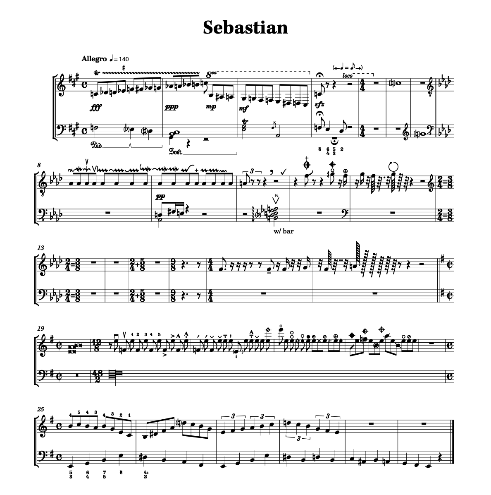

# Sebastian music font

Sebastian is a SMuFL-compatible music font, developed by Florian Kretlow and expanded upon by Ben Byram-Wigfield, with over 1200 glyphs (some taken from the Bravura reference font). SMuFL reference can be found here: (https://w3c.github.io/smufl/gitbook/). The font also contains a set of glyphs in the 'old' 8-bit character positions, for compatibility with old versions of Finale and other apps.

The fonts are licensed under the [SIL Open Font License](http://scripts.sil.org/ofl). You are free to use, copy and modify this font. Modified versions must use a different name.

The source files are provided as Unified Font Object (UFO) data structure in the src folder.

Releases will contain an OTF font and the SMuFL *metadata.json* file that supplies supplementary data. [They can be found here](https://github.com/fkretlow/sebastian/releases).

The JSON file needs to be installed in one of the following locations:

Windows: `C:\Program Files\Common Files\SMuFL\Fonts\Sebastian\Sebastian.json`
Mac: `/Library/Application Support/SMuFL/Fonts/Sebastian/Sebastian.json`
Linux: `/usr/share/SMuFL/Fonts/Sebastian/Sebastian.json`

For more detailed info about the metadata file's location, see here:  
https://w3c.github.io/smufl/latest/specification/font-metadata-locations.html

The repository also includes glyphs in the 'legacy 8-bit' character slots, for use in non-SMuFL apps like Finale (26 and earlier), in the *legacy* folder.
 

FK, BBW - September 2021
